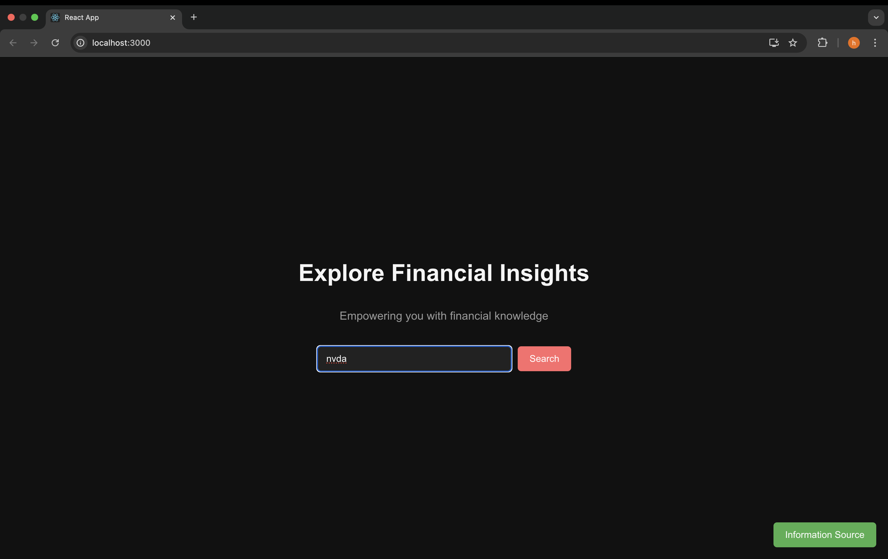
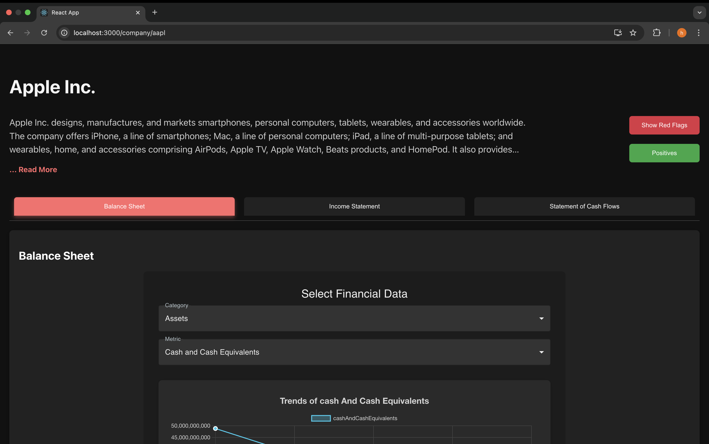
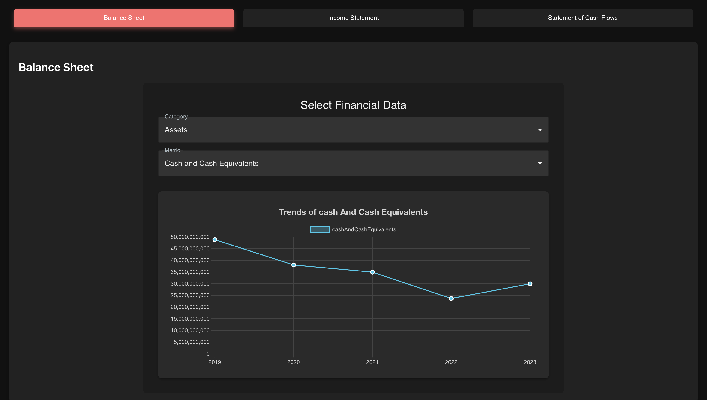
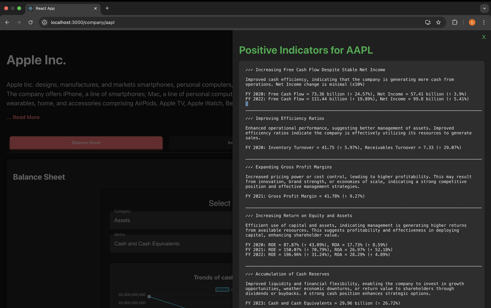
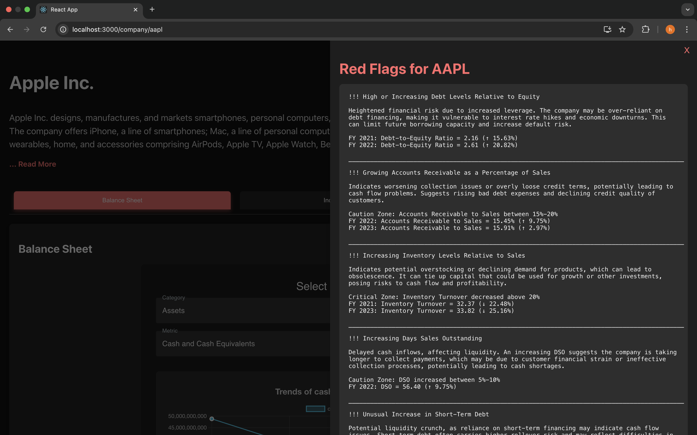

## Financial Indicators – Company Health Analysis Application

Financial Indicators is a full-stack financial analytics application that evaluates public company fundamentals to surface strengths, risks and behavioral trends across Balance Sheets, Income Statements and Cash Flow Statements.

The system transforms raw financial statement data into interpretable insights, combining trend analysis, financial ratios and rule-based heuristics to highlight **positive indicators** and **red flags** that support exploratory investment and risk assessment workflows.

---

### Table of Contents

- [Features](#features)
- [Application Overview](#application-overview)
- [Analytics & Insights](#analytics--insights)
- [System Architecture](#system-architecture)
- [Repository Structure](#repository-structure)
- [Setup & Local Development](#setup--local-development)
- [Technology Stack](#technology-stack)
- [Contributions](#contributions)

---

### Features

- Ticker-Based Company Search (AAPL, TSLA, NVDA, etc.)
- Interactive Financial Trend Charts (multi-year)
- Balance Sheet, Income Statement & Cash Flow Views
- Metric-Level Drilldowns (assets, liabilities, equity)
- Automated Positive Indicator Detection
- Rule-Based Red Flag Identification
- Dark-Themed Analyst-Friendly UI
- Modular Backend Services for Analytics Logic

---

### Application Overview

#### Landing Page – Company Search



Users begin by searching for a company ticker symbol. The system fetches structured financial data and presents an overview of the firm along with access to detailed analytics.

---

#### Company Overview & Navigation



The interface provides quick navigation between:
- Balance Sheet
- Income Statement
- Statement of Cash Flows  

Each section supports interactive metric selection and historical trend analysis.

---

### Analytics & Insights

#### Balance Sheet Trend



Users can explore trends across:

- Assets
- Liabilities
- Equity  

with granular metrics such as:

- Cash & Cash Equivalents
- Net Receivables
- Inventory
- Property, Plant & Equipment
- Total Assets

---

#### Positive Indicators Panel



The panel highlights financial strengths such as:

- Increasing Free Cash Flow
- Improving Return on Assets (ROA) and Return on Equity (ROE)
- Expanding Profit Margins
- Improved operational efficiency
- Strengthening cash reserves  

These indicators are derived using rule-based comparisons across fiscal periods.

---

#### Red Flags Panel



Potential risks are flagged when thresholds are crossed, including:

- Rising debt-to-equity ratios
- Increasing Days Sales Outstanding (DSO)
- Inventory buildup relative to sales
- Growth in short-term debt
- Deterioration in working capital efficiency  

The goal is early risk visibility, not prediction.

---

### System Architecture

```
React Frontend
     |
     | REST API
     v
Flask Backend
 ├── Controllers & Services
 ├── Analytics Logic
 │    ├── Positive Indicators
 │    └── Red Flags
 ├── SQLite Database
 └── External Financial Data API
      (Financial Modeling Prep)
```

The architecture separates **presentation**, **business logic** and **data access**, allowing analytics rules to evolve independently of the UI.

#### Repository Structure

```
financial-indicators/
│
├── backend/
│   ├── app/
│   │   ├── analysis_service.py
│   │   ├── financial_controller.py
│   │   ├── financial_service.py
│   │   ├── positive_indicators_service.py
│   │   ├── redflags_service.py
│   │   ├── db.py
│   │   └── models.py
│   │
│   ├── instance/
│   │   └── lh7.db
│   │
│   ├── run.py
│   ├── requirements.txt
│   └── runtime.txt
│
├── frontend/
│   ├── public/
│   ├── src/
│   ├── package.json
│   └── package-lock.json
│
├── readme_images/
│   └── *.png
│
├── docker-compose.yml
├── Dockerfile
├── docker_setup.md
└── README.md
```

### Setup & Local Development

#### Prerequisites

-   Python 3.12.6
-   Node.js v20.17.0
-   npm 10.8.2
-   Financial Modeling Prep API key
    
----------

#### Backend (Flask)

```
cd backend
python -m venv venv
source venv/bin/activate        # macOS
# venv\Scripts\activate         # Windows
pip install -r requirements.txt
python run.py
```

Backend runs at:

```
http://127.0.0.1:5000
```

----------

#### Frontend (React)

```
cd frontend
npm install
npm start
```

Frontend runs at:

```
http://localhost:3000
```
### Technology Stack

**Frontend**

-   React
-   JavaScript (ES6+)
-   Chart.js
-   CSS (Dark UI)
    

**Backend**

-   Python
-   Flask
-   SQLite
-   REST APIs
    

**Data Source**

-   Financial Modeling Prep API

### Contributions

This project was developed collaboratively as part of a graduate capstone initiative. 
It incorporates the ideas, analysis and development efforts of Athul Vinod, Harikrishnan Nair, Komal Vashistha and Qianqian Kong.
